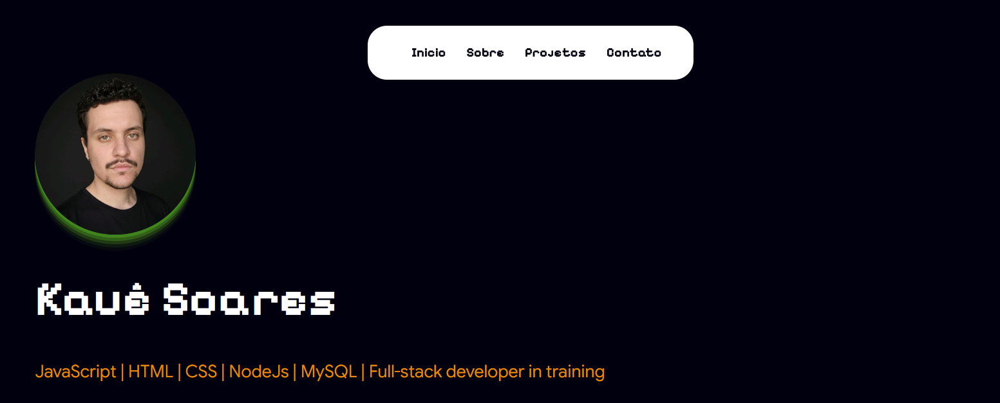

# 💼 Meu Portfólio

Portfólio pessoal de **Kauê Soares**, desenvolvedor Front-End em formação. Reúne meus projetos, habilidades e formas de contato.

🔗 **Site:** [soares-kaue.github.io/my-portfolio](https://soares-kaue.github.io/my-portfolio/)



## Seções

- [Apresentação com foto e resumo]
- [Sobre mim]
- [Habilidades]
- [Projetos com links para demo e código]
- [Contato]

## Tecnologias

- HTML5
- CSS3
- JavaScript ([o que ele faz, ex.: menu mobile, animações ao rolar])
- GitHub Pages

## Como rodar localmente

1. Clone o repositório:
```bash
   git clone https://github.com/soares-kaue/my-portfolio.git
```
2. Entre na pasta:
```bash
   cd my-portfolio
```
3. Abra o `index.html` no navegador.

## O que aprendi

- Estruturar um site completo com HTML semântico
- Criar layouts responsivos com CSS
- Organizar e publicar um projeto com Git e GitHub Pages

## Autor

**Kauê Soares**
[LinkedIn](https://www.linkedin.com/in/iamkaue) · office.kauesoares@gmail.com
